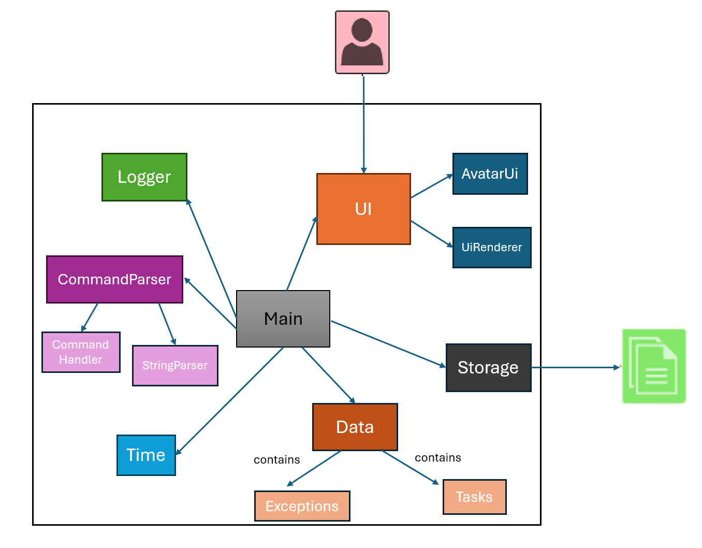
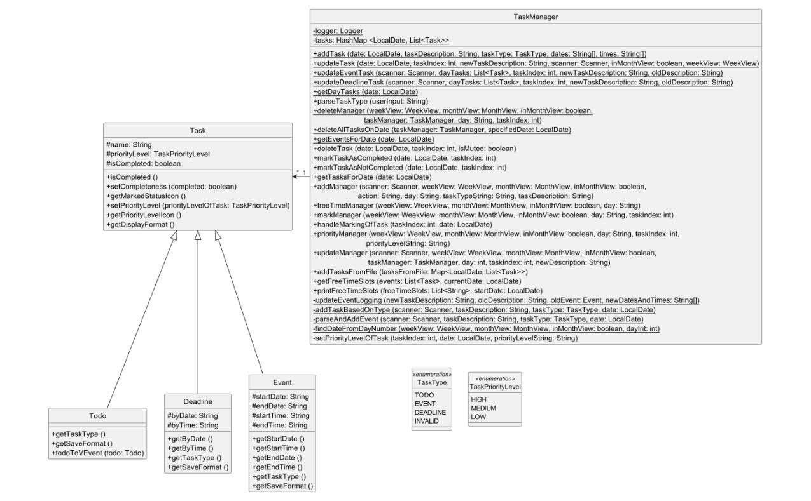
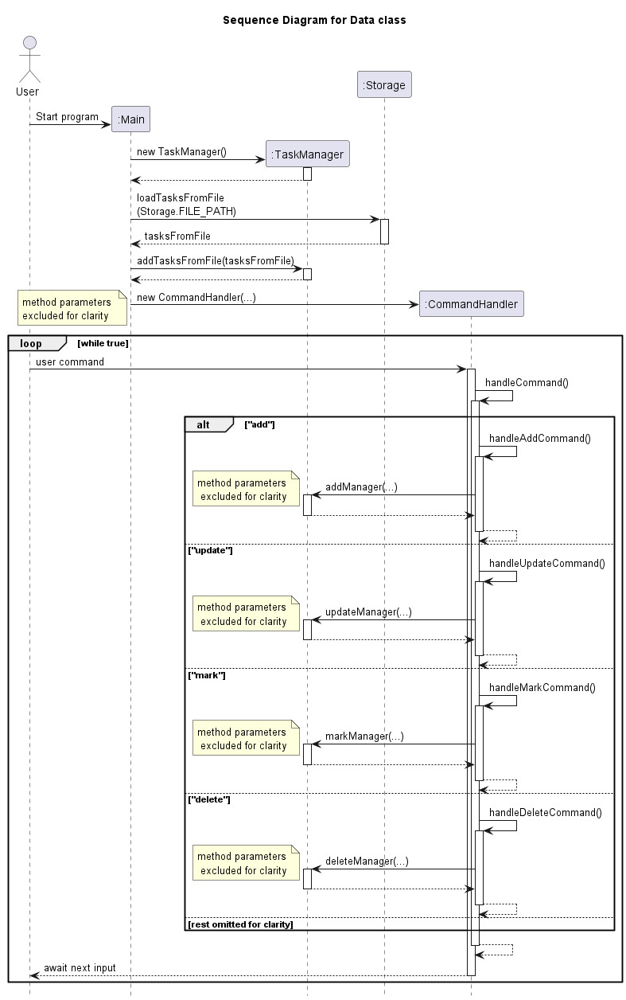
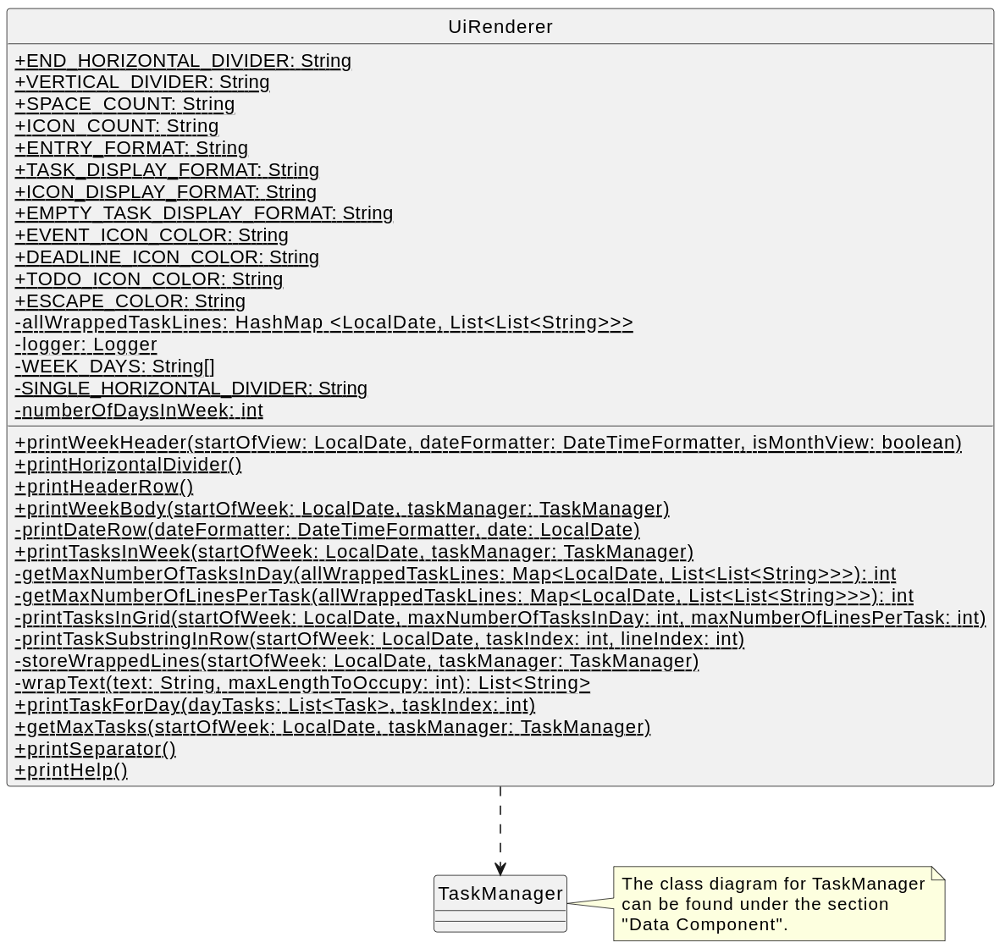
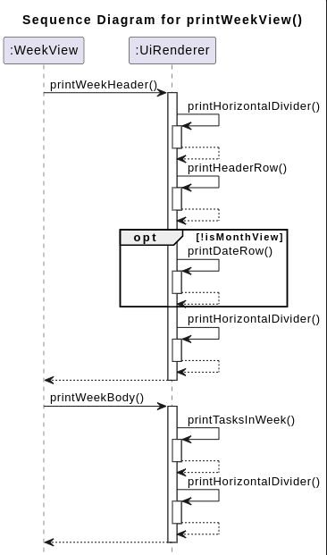
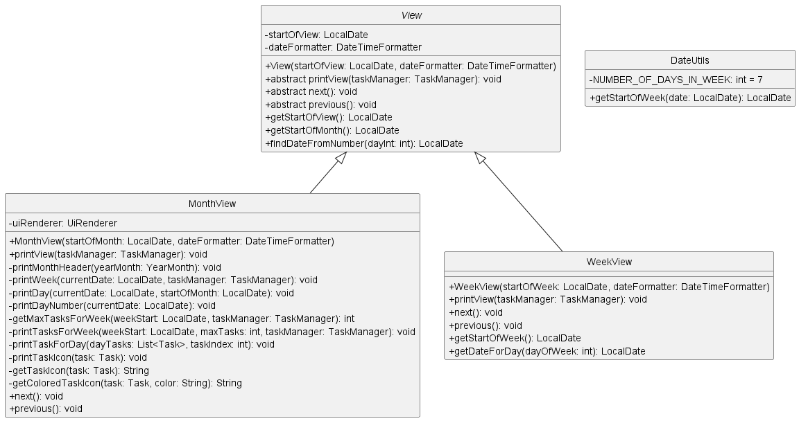
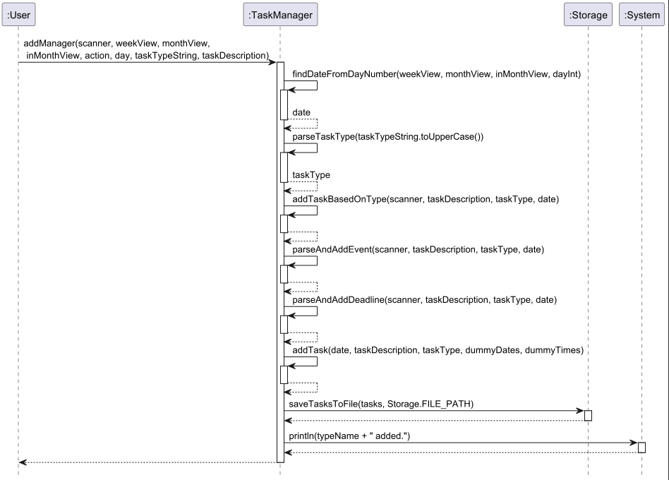
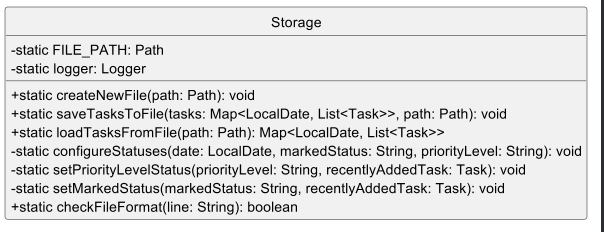
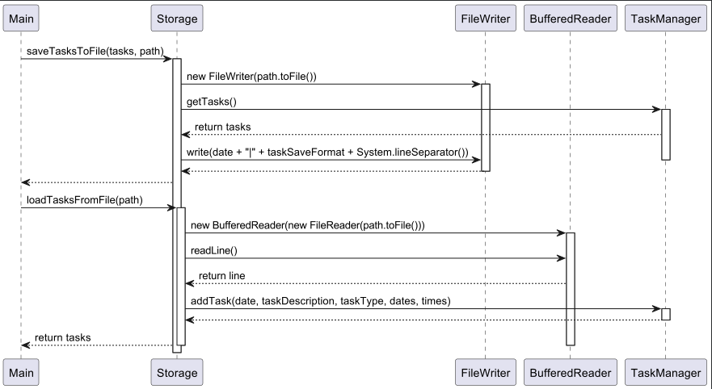
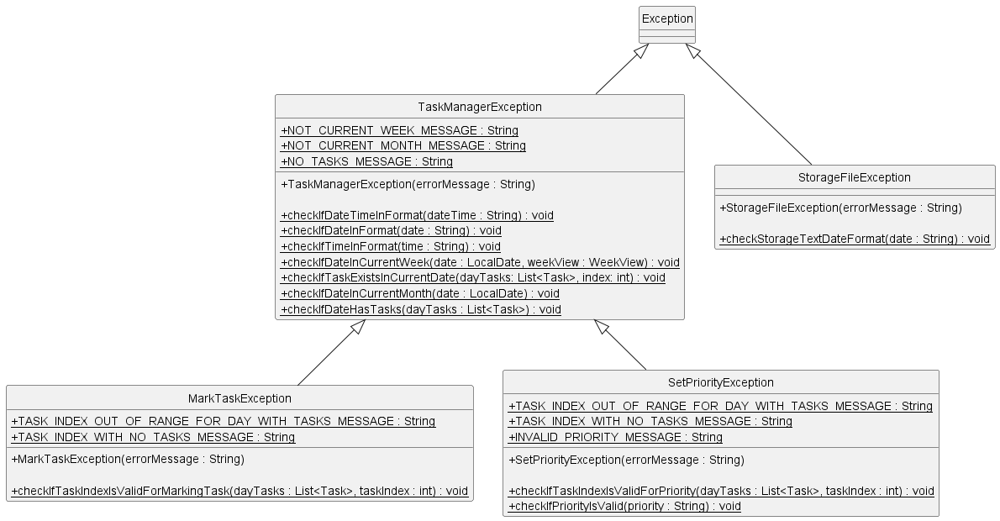

# Developer Guide
* [Acknowledgements](#acknowledgements)
* [Architecture](#architecture)
* [Design & Implementation](#design--implementation)
  * [Data Component](#data-component)
  * [UiRenderer Component](#uirenderer-component)
  * [View Switching](#view-switching)
  * [Utilities](#utilities)
  * [TaskManager Component](#taskmanager-component)
    * [Retrieving tasks from the TaskManager](#retrieving-tasks-from-the-taskmanager)
    * [Updating a Task](#updating-a-task)
    * [Update Task Method](#update-task-method)
    * [Adding Tasks](#adding-tasks)
    * [Deleting Tasks](#deleting-tasks)
    * [Interfacing with Storage class](#interfacing-with-storage-class)]
  * [Storage component](#storage-component)
  * [Exceptions and Logging](#exceptions-and-logging)
  * [Exporting .ics File Component](#exporting-ics-file-component)
* [Appendix: Requirements](#appendix-requirements)
  * [Product scope](#product-scope)
    * [Target user profile](#target-user-profile)
    * [Value proposition](#value-proposition)
  * [User Stories](#user-stories)
  * [Non-Functional Requirements](#non-functional-requirements)
  * [Glossary](#glossary)
  * [Instructions for manual testing](#instructions-for-manual-testing)

## Acknowledgements

{list here sources of all reused/adapted ideas, code, documentation, and third-party libraries -- include links to the original source as well}

ical4J Library: [https://www.ical4j.org/](https://www.ical4j.org/)


## Architecture
The ***Architecture diagram*** given below shows the high-level architecture of CLI-nton.
The application is designed with a modular architecture, consisting of the following components:



#### Main Components of the architecture
- **UI**: The `UiRenderer` class handles the rendering of the calendar views (week and month) to the console, and 'AvatarUi' class handles the rendering of the avatar.
- **Main**: The `Main` class acts as the central logic component, handling user input and dispatching commands to the appropriate components.
- **Data**: The `TaskManager` class manages the tasks and their corresponding dates, providing methods for adding, updating, and deleting tasks. 'Exceptions' contains the exceptions that are thrown by the application.
- **Storage**: The `Storage` class handles the writing and reading of tasks to and from clintonData.txt file, ensuring persistence of task data across sessions.
- **Time**: The `DateUtils` class provides utility methods for working with dates and times.
- **Logger**: The `FileLogger` class sets up a logger that writes log messages to the `logs.log` file in the project directory.
- **CommandParser**: The `CommandParser` class parses user input commands and extracts relevant information for processing.

# Design & Implementation

## Data Component
### API: [Data](https://github.com/AY2324S2-CS2113-W13-2/tp/tree/master/src/main/java/data)

The 'Data' package consists of all the classes that the commands interact with to perform various functions.
Below is a summary of the classes found in the Data package:
- The `TaskManager` class is created that contains all local copies of `Task`, creating a many-to-one relationship with `Task`.
- `Task` is the superclass of all created tasks, namely: `Todo`, `Deadline`, and `Event`.
- When an operation is requested by the user, the `TaskManager` instance calls its own methods to create/read/update/delete the tasks.
- `TaskManagerException` extends the Java class `Exception`, and used when there are exceptions to be handled.
- `TaskType` is an enumeration used in classifying the types of `Task` created.
- `TaskPriorityLevel` is an enumeration used in classifying the priority level of a `Task`.

Below is a sequence diagram that illustrates a possible sequence when the user runs CLI-nton:

## UiRenderer Component
### API: [UiRenderer.java](https://github.com/AY2324S2-CS2113-W13-2/tp/blob/master/src/main/java/ui/UiRenderer.java)


### Overview: <br> 
The UiRenderer component is responsible for rendering the user interface. It is used to display messages, week views as well as month views to the user.

### How it works:
1. When week view is requested, the UiRenderer component will render the week view.
2. This is done by printing the table in ASCII art format, with the days of the week as columns.
3. The week view will display the tasks for the week, with the tasks for each day displayed in the respective columns.
4. The month view will display a summary of the tasks for each day in the month, with the dates of the month displayed in a month calendar format.

### printView Method for Week View


### printWeekHeader Method
`printWeekHeader` Method

The `printWeekHeader` method is responsible for rendering the header section of the week and month view, including the names of the days and the dates.

#### Method signature:
```
public static void printWeekHeader(LocalDate startOfView, DateTimeFormatter dateFormatter, boolean isMonthView)
```

#### Parameters
- startOfView: The starting date of the week view.
- dateFormatter: Formatter for displaying dates.
- isMonthView: A boolean flag indicating if the month view is being rendered.

#### Method Functionality
- Prints a horizontal divider to delineate the start of the header.
- Displays the names of the days as column headers.
- If not in month view, prints the dates for the respective week.

### printWeekBody Method
The `printWeekBody` method displays the body of the week view, showing tasks for each day in their respective columns.

#### Method Signature
```
public static void printWeekBody(LocalDate startOfWeek, TaskManager taskManager)
```

#### Parameters
- startOfWeek: The starting date of the week for which tasks are displayed.
- dateFormatter: Formatter for displaying dates.
- taskManager: The TaskManager instance managing tasks.

#### Method Functionality
- Calls `printTasksInWeek`, which prints the tasks for each day in the week.

### printTasksInWeek Method
The `printTasksInWeek` method displays the tasks for each day in the week view, wrapping the task descriptions to fit within the column width.

#### Method Signature
```
public static void printTasksInWeek(LocalDate startOfWeek, TaskManager taskManager)
```

#### Parameters
- startOfWeek: The starting date of the week for which tasks are displayed.
- taskManager: The TaskManager instance managing tasks.

#### Method Functionality
- Retrieves the tasks for each day in the week into a map.
- Wrap the task descriptions to the width of the calendar box.
- Stores the task descriptions in a map.
- Prints the task descriptions for each day in the week in the appropriate formatting.

### Month View Rendering
The month view utilizes the printWeekHeader method with the isMonthView parameter set to true, limiting the display to only include week headers without individual tasks.

### printMonthView Method
The `printView` method in the `MonthView` is responsible for rendering the month view, displaying the calendar grid and the tasks for each day.

#### Method Signature
```
@Override
public void printView(TaskManager taskManager)
```

#### Parameters
- `taskManager`: The TaskManager instance containing the tasks to be displayed.

#### Method Functionality
1. Calculates the `YearMonth` and the first day of the month that falls on a Sunday.
2. Prints the month header using the `printMonthHeader` method.
3. Calls the `printWeekHeader` method from the `UiRenderer` to display the week header.
4. Iterates through the weeks in the month, calling the `printWeek` method for each week.
5. The `printWeek` method calculates the start date of the week, prints the day numbers, and then calls `printTasksForWeek` to display the tasks for that week.

#### Sequence Diagram


The sequence diagram above illustrates the interactions between the `m:MonthView`, `u:UiRenderer`, `t:TaskManager`, and `l:Logger` classes during the execution of the `printView` method.

### printHelp Method
The printHelp method provides users with a list of available commands and their descriptions, aiding in navigation and task management.

#### Method Signature
```
public static void printHelp()
```

#### Method Functionality
- Prints a structured list of commands and their purposes within the user interface.

## View Switching

The Calendar application supports switching between the week and month views, allowing users to visualize their tasks in different time perspectives. The switching functionality is implemented through the `WeekView` and `MonthView` classes, which extend the `View` abstract class.

### View Hierarchy

The `View` abstract class provides a common interface for rendering and navigating different calendar views. It defines the following abstract methods:

- `printView(TaskManager taskManager)`: This method is responsible for rendering the view to the console based on the provided `TaskManager` instance.
- `next()`: This method advances the view to the next period (e.g., next week or next month).
- `previous()`: This method moves the view to the previous period (e.g., previous week or previous month).
- 


The `View` class also has a protected `startOfView` field, which represents the starting date of the current view period, and a `dateFormatter` field for formatting dates.

### WeekView

The `WeekView` class extends the `View` abstract class and provides an implementation for rendering and navigating the week view. It overrides the following methods from the `View` class:

- `printView(TaskManager taskManager)`: This method first calculates the end of the week based on the `startOfView` date. It then prints the week header using the `UiRenderer.printWeekHeader` method and the week body using the `UiRenderer.printWeekBody` method.
- `next()`: This method advances the `startOfView` date to the start of the next week by adding one week.
- `previous()`: This method moves the `startOfView` date to the start of the previous week by subtracting one week.

The `WeekView` class also provides the following utility methods:

- `getStartOfWeek()`: Returns the `startOfView` date, which represents the start of the current week.
- `getDateForDay(int dayOfWeek)`: Returns the date for a specific day of the week based on the `startOfView` date. The `dayOfWeek` parameter is expected to be a value between 1 (Monday) and 7 (Sunday).

### MonthView

The `MonthView` class extends the `View` abstract class and provides an implementation for rendering and navigating the month view. It overrides the following methods from the `View` class:

- `printView(TaskManager taskManager)`: This method first calculates the start of the month and the first day of the month that falls on a Sunday. It then prints the month header using the `UiRenderer.printWeekHeader` method with the `isMonthView` flag set to `true`. The method iterates over the weeks in the month and calls the `printWeek` method for each week.
- `next()`: This method advances the `startOfView` date to the start of the next month.
- `previous()`: This method moves the `startOfView` date to the start of the previous month.

The `MonthView` class also provides the following private methods:

- `printWeek(LocalDate current, TaskManager taskManager)`: This method prints a single week within the month view. It iterates over the days of the week and calls the `printDay` method for each day. It also prints the tasks for the week using the `printTasksForWeek` method.
- `printDay(LocalDate currentDate, LocalDate startOfMonth)`: This method prints the day number for a given date within the month view.
- `getMaxTasksForWeek(LocalDate weekStart, TaskManager taskManager)`: This method calculates the maximum number of tasks for a given week by iterating over the days of the week and finding the maximum number of tasks for any day.
- `printTasksForWeek(LocalDate weekStart, int maxTasks, TaskManager taskManager)`: This method prints the tasks for a given week within the month view. It iterates over the tasks and calls the `printTaskForDay` method for each task.
- `printTaskForDay(List<Task> dayTasks, int taskIndex)`: This method prints a single task for a given day within the month view.

### View Switching in CommandHandler

The `CommandHandler` class is responsible for handling user input and dispatching commands to the appropriate components. It manages the switching between the week and month views based on the user's input.

When the user enters the `month` command, the `CommandHandler` class calls the `handleMonthCommand()` method, which toggles the `inMonthView` flag and renders the month view by calling the `printView` method of the `MonthView` instance. Similarly, when the user enters the `week` command, the `CommandHandler` class calls the `handleWeekCommand()` method, which sets the `inMonthView` flag to `false` and renders the week view by calling the `printView` method of the `WeekView` instance.

The following code snippets illustrate the view switching logic in the `CommandHandler` class:

```java
private void handleMonthCommand() {
    inMonthView = true;
}
```

This `handleMonthCommand()` method sets the `inMonthView` flag to `true`, indicating that the month view should be displayed.

```java
private void handleWeekCommand() {
    inMonthView = false;
}
```

This `handleWeekCommand()` method sets the `inMonthView` flag to `false`, indicating that the week view should be displayed.

The `handleCommand()` method in the `CommandHandler` class is responsible for rendering the appropriate view based on the `inMonthView` flag:

```java
public void handleCommand() {
  AvatarUi.printAvatar();
  if (!inMonthView) {
    weekView.printView(taskManager);
  } else {
    monthView.printView(taskManager);
  }

  System.out.println("Enter help to learn commands");
  String input = scanner.nextLine().trim().toLowerCase();
  String[] parts = input.split(",\\s*");
  String command = parts[0];

  switch (command) {
  // ...
  case "month":
    handleMonthCommand();
    break;
  case "week":
    handleWeekCommand();
    break;
  // ...
  }
}
```
This method first prints the avatar using `AvatarUi.printAvatar()`, and then checks the value of the `inMonthView` flag to determine whether to call `weekView.printView(taskManager)` or `monthView.printView(taskManager)` to render the appropriate view.

## Utilities
The `DateUtils` class provides a utility method `getStartOfWeek` that returns the start date of the week for a given date.

## TaskManager Component

### Overview: 
The TaskManager is responsible for handling the creation, reading, updating and deletion [CRUD] of tasks.

#### How it works:
1. When the program starts, a TaskManager instance is created.
2. Saved tasks are retrieved by interfacing with the Storage class to create required tasks and save them to this 
instance of TaskManager.  
3. When the user requests an operation, the main function parses the input and hands it to TaskManager if it is related
4. The TaskManager will handle all requests relating to tasks, using methods detailed in the following sections.
5. The TaskManager will also create INFO-level logs when making changes to tasks.

#### Task Types
`TaskManager` supports different task types to be created by the user.
The `TaskType` enum defines the different types of tasks supported by the application: `TODO`, `EVENT`, and `DEADLINE`.
There is also a `INVALID` type, used for error handling.

### Retrieving tasks from the TaskManager
#### getTasksForDate Method
The `getTasksForDate` method is responsible for retrieving all tasks on a specified date.
This is a helper function that is called whenever tasks relating to a certain date is needed.

#### Method signature:
```
public List<Task> getTasksForDate(LocalDate date)
```

#### Parameters
- date: The date to retrieve tasks for.

#### Method Functionality
- Gets the LocalDate requested by the caller.
- Returns an ArrayList of Tasks for the specified date. It **is** possible that an empty ArrayList is returned, given
that there are no tasks on that specified date.

### Updating a Task
#### Overview

Updating a task involves modifying its description or other attributes such as date or time. This guide outlines the process and considerations for updating tasks within the application.

#### Update Manager Method

The `updateManager` method facilitates the updating of tasks. It prompts the user for an updated task description and handles tasks of different types (Todo, Event, Deadline) while ensuring the changes are correctly reflected in the application.

#### Method Signature

```
public void updateManager(Scanner scanner, WeekView weekView, MonthView monthView, boolean inMonthView,
                          TaskManager taskManager, int day, int taskIndex, String newDescription)
        throws TaskManagerException, DateTimeParseException
```

#### Parameters

- `scanner`: Scanner object for user input.
- `weekView`: Current week being viewed.
- `monthView`: Current month being viewed.
- `inMonthView`: Boolean indicating whether the month is being viewed.
- `taskManager`: TaskManager instance managing tasks.
- `day`: Day of the task.
- `taskIndex`: Index of the task to update.
- `newDescription`: Updated description of the task.

#### Exceptions

- `TaskManagerException`: Thrown if not in the correct week/month view.
- `DateTimeParseException`: Thrown if there is an error parsing the date.

#### Method Functionality

1. Converts the specified day to a `LocalDate`.
2. Verifies if the date is in the current week/month view.
3. Updates the task description based on its type.
4. Saves the updated tasks to the appropriate file.
5. Provides feedback to the user upon successful update.

### Update Task Method

The `updateTask` method is responsible for modifying the details of a task based on the user input.

#### Method Signature

```
public static void updateTask(LocalDate date, int taskIndex, String newTaskDescription, Scanner scanner,
        boolean inMonthView, WeekView weekView)
        throws IndexOutOfBoundsException, TaskManagerException {
```

#### Parameters

- `date`: Date of the task.
- `taskIndex`: Index of the task to update.
- `newTaskDescription`: Updated description of the task.
- `scanner`: Scanner object for user input.

#### Exceptions

- `IndexOutOfBoundsException`: Thrown if the task index is out of bounds.

#### Method Functionality

1. Retrieves the tasks for the specified date.
2. Validates if the task index is within bounds.
3. Handles different task types (Todo, Event, Deadline).
4. Updates the task description accordingly.
5. Logs the changes if applicable.

### Adding Tasks

#### Overview

The Add Task feature enhances the TaskManager application by enabling users to create various types of tasks such as Todo, Event, and Deadline. This section elaborates on the implementation details of this feature, encompassing methods for task creation, user input handling, and task addition management.

#### `addTask` Method

The `addTask` method orchestrates the creation and addition of a new task to the TaskManager. It accepts parameters including the task date, description, type, and relevant dates/times for events and deadlines. Depending on the task type, it constructs the corresponding task object (Todo, Event, or Deadline) and integrates it into the tasks map.

#### Method Signature

```
public static void addTask(LocalDate date, String taskDescription, TaskType taskType,
        String[] dates, String[] times) throws TaskManagerException {
```

#### Parameters

- `date`: The date for the task.
- `taskDescription`: The description of the task.
- `taskType`: The type of the task (Todo, Event, or Deadline).
- `dates`: An array containing relevant dates for events and deadlines.
- `times`: An array containing relevant times for events and deadlines.

#### Exceptions

- `TaskManagerException`: Thrown if there is an error in managing tasks.

#### `addManager` Method

The `addManager` method facilitates the management of adding tasks from user input along with the specified date. It prompts users to input task details, validates the input, and delegates the task creation process to the `addTask` method.
The sequence diagram below illustrates the flow of the `addManager` method:


#### Method Signature

```
public void addManager(Scanner scanner, WeekView weekView, MonthView monthView, boolean inMonthView, String action,
        String day, String taskTypeString, String taskDescription)
        throws TaskManagerException, DateTimeParseException
```

#### Parameters

- `scanner`: Scanner object for user input.
- `weekView`: WeekView object for date validation.
- `monthView`: MonthView object for date validation.
- `inMonthView`: Boolean indicating whether the view is in month view.
- `action`: Action to be performed.
- `day`: Day for the task.
- `taskTypeString`: String representing the task type.
- `taskDescription`: Description of the task.

#### Exceptions

- `TaskManagerException`: Thrown if there is an error in managing tasks.
- `DateTimeParseException`: Thrown if there is an error parsing the date or time.

#### Handling User Input

This segment prompts users to input essential details for task creation, encompassing descriptions, dates, and times for events and deadlines. It utilizes the `Scanner` class to capture and validate user input before initiating task creation.

#### Task Type Switch Statement

Within the `addTask` method, a switch statement delineates the type of task being created based on the `taskType` parameter. Corresponding actions are executed to create and add the task to the tasks map based on the identified type.

#### Error Handling

The implementation incorporates error handling mechanisms to effectively manage scenarios involving invalid inputs or unsupported task types. 
Below is a list of exceptions and a description of how they are handled:
* `TaskManagerException`: Handles errors that occur during task creation, such as invalid dates or task types.
* `DateTimeParseException`: Manages exceptions related to date and time parsing errors.
* `IndexOutOfBoundsException`: Ensures the task index is within bounds when updating tasks.
* `StorageFileException`: Handles issues related to the storage of task data, such as invalid date formats in the task file.
* `MarkTaskException`: Manages exceptions that occur when marking a task as complete.
* `SetPriorityException`: Handles exceptions related to setting the priority of a task.

#### Saving Tasks to File

Upon task creation, the `addTask` method guarantees the preservation of the updated task list to a file (`clintonData.txt`) by invoking the `saveTasksToFile` method from the `Storage` class. This serves to persist task data across application sessions.

#### Exceptions

`IndexOutOfBoundsException`: Thrown if the task index is out of bounds.

#### Method Functionality

1. Retrieves the tasks for the specified date.
2. Validates if the task index is within bounds.
3. Handles different task types (Todo, Event, Deadline).
4. Updates the task description accordingly.
5. Logs the changes if applicable.

### Deleting Tasks

#### deleteTask Method
The `deleteTask` method is responsible for deleting a task specified by the user, on a specified date.

#### Method signature:
```
public void deleteTask(LocalDate date, int taskIndex, boolean isMuted)
```

#### Parameters
- date: The date of the task.
- taskIndex: The index of the task to delete.
- isMuted: Whether system outputs are muted. 

#### Method Functionality
- Gets the LocalDate requested by the user.
- Checks if there is are active tasks on the selected date, and checks if the date is within the period currently shown
  on the UI [week or month view].
- Deletes the task if the above two checks pass, else highlights to the user through a console-printed error message.
- If `isMuted` is True, no outputs are printed to the console. Only true when used in testing. 

#### deleteAllTasksOnDate Method
The `deleteAllTasksOnDate` method is responsible for deleting **ALL** tasks on a date specified by the user.
> Do note that this method is **NOT** used is normal operation of the application. It is currently only being used in 
> testing, for easier delete operations for dummy tasks created on a date. 

#### Method signature:
```
public static void deleteAllTasksOnDate (TaskManager taskManager, LocalDate specifiedDate)
```

#### Parameters
- taskManager: The taskManager class in use.
- specifiedDate: The date on which all tasks are to be deleted.

#### Method Functionality
- Gets the LocalDate requested by the caller.
- Calls the `deleteTask` method on all tasks on the date.

### Interfacing with Storage class
#### `addTasksFromFile` method
The `addTasksFromFile` method is responsible for parsing save data generated by the `Storage` class.
> See more details on the `Storage` class below.

#### Method signature:
```
public void addTasksFromFile(Map<LocalDate, List<Task>> tasksFromFile) throws TaskManagerException
```

#### Parameters
- tasksFromFile: A map containing tasks read from a file.

#### Exceptions
- `TaskManagerException`: Thrown if there is an error adding tasks.

#### Method Functionality
- Gets the map that contains all tasks from the save file, generated by `Storage.loadFilesFromFile`.
- Attempts to parse each individual task found in the list and add it to the currently-active instance of TaskManager.
- Logs any important messages to log file, if any.

## Storage component
**API** : [Storage.java](https://github.com/AY2324S2-CS2113-W13-2/tp/blob/master/src/main/java/storage/Storage.java)

The 'storage' component:
* Creates new file if `./save/clintonData.txt` does not exist.
* Reads tasks from the formatted `./save/clintonData.txt` file and appends to task hashmap.
* Identifies unique tasks stored in task hashmap, parses and writes to `./save/clintonData.txt` file.
* Handles exception if `./save/clintonData.txt` is in corrupted format.

Below is a UML class diagram of the Storage component:


The `saveTasksToFile` method writes the tasks in a HashMap to the file in the following format:

```
<date>|<taskType>|<markedStatus>|<priorityLevel>|<taskDescription>|<taskDetails>
```

For example:

```
2024-04-15|D|O|L|task 2|19/04/2024|1400
2024-04-18|E|O|L|event 1|14/04/2024|19/04/2024|1200|1200
2024-04-17|T|O|L|cs2113 deadline

```

The `loadTasksFromFile` method reads the tasks from the file and populates the `TaskManager` with the loaded tasks.


Shown below is the sequence diagram for 'saveTasksToFile' and 'loadTasksFromFile' methods:


## CommandHandler Component

### API: [CommandHandler.java](https://github.com/AY2324S2-CS2113-W13-2/tp/blob/master/src/main/java/commandparser/CommandHandler.java)

### Overview:
The `CommandHandler` class is responsible for parsing user input, validating commands, and delegating the appropriate actions to the corresponding components, such as `TaskManager`, `WeekView`, and `MonthView`.

### How it Works:
1. When the user enters a command, the `handleCommand()` method is called.
2. The method first prints the avatar using the `AvatarUi.printAvatar()` method.
3. It then checks the current view mode (`inMonthView`) and calls the appropriate `printView()` method of `WeekView` or `MonthView` to display the current calendar view.
4. The user's input is then parsed, and the appropriate command handling method is called, such as `handleNextCommand()`, `handleAddCommand()`, `handleDeleteCommand()`, etc.
5. Each command handling method performs the necessary validations, processes the user input, and delegates the task to the appropriate component(s).
6. The `printHelp()` method is called when the user enters the "help" command, displaying a list of available commands.
7. The `handleQuitCommand()` method is called when the user enters the "quit" command, which exits the application.

### `handleCommand()` Method
The `handleCommand()` method is the entry point for processing user commands. It performs the following steps:

1. Prints the avatar using `AvatarUi.printAvatar()`.
2. Determines the current view mode (`inMonthView`) and calls the appropriate `printView()` method of `WeekView` or `MonthView`.
3. Prompts the user to enter a command and reads the input using the `scanner`.
4. Splits the input into command parts using `,\s*` as the delimiter.
5. Extracts the command from the first part of the input.
6. Calls the corresponding command handling method based on the command, such as `handleNextCommand()`, `handleAddCommand()`, `handleDeleteCommand()`, etc.
7. If the command is not recognized, it prints an error message.

### Command Handling Methods
The `CommandHandler` class provides various command handling methods, each responsible for processing a specific type of command. These methods perform the following tasks:

1. **handleNextCommand()**: Advances the current view to the next week or month, depending on the current view mode.
2. **handlePreviousCommand()**: Moves the current view to the previous week or month, depending on the current view mode.
3. **handleUpdateCommand(String[] parts)**: Validates the update command format, extracts the necessary information (day, task index, new description), and updates the task using the `TaskManager.updateManager()` method.
4. **handleAddCommand(String[] parts)**: Validates the add command format, extracts the necessary information (day, task type, task description), and adds the task using the `TaskManager.addManager()` method.
5. **handleDeleteCommand(String[] parts)**: Validates the delete command format, extracts the necessary information (day, task index), and deletes the task using the `TaskManager.deleteManager()` method.
6. **handleMarkCommand(String[] parts)**: Validates the mark command format, extracts the necessary information (day, task index), and marks the task as completed using the `TaskManager.markManager()` method.
7. **handlePriorityCommand(String[] parts)**: Validates the priority command format, extracts the necessary information (day, task index, priority level), and sets the priority of the task using the `TaskManager.priorityManager()` method.
8. **handleMonthCommand()**: Switches the view to the month view by calling the `monthView.printView(taskManager)` method and toggling the `inMonthView` flag.
9. **handleWeekCommand()**: Switches the view to the week view by setting the `inMonthView` flag to `false`.
10. **printHelp()**: Prints the help message, displaying the available commands and their descriptions.
11. **handleQuitCommand()**: Exits the application.

### UML Class Diagram for CommandHandler


The `CommandHandler` class has dependencies on the `TaskManager`, `WeekView`, `MonthView`, and `StringParser` classes. 
The `Main` class creates instances of these classes and passes them to the `CommandHandler` constructor.

## Exceptions and Logging

### Exceptions



The project utilizes centralized exception handling through the `TaskManagerException` class and its subclasses, 
`MarkTaskException` and `SetPriorityException`.

The `TaskManagerException` class serves as the base exception class, providing common functionality for handling 
exceptions related to the Task Manager. It includes methods to check the validity of dates, times, and task lists, 
and throws appropriate exceptions with corresponding error messages.

```java
public class TaskManagerException extends Exception {
    public static final String NOT_CURRENT_WEEK_MESSAGE = "The date must be within the current week. Please try again.";
    public static final String NOT_CURRENT_MONTH_MESSAGE = "The date must be within the current month. " +
            "Please try again.";
    // Other error message constants

    public TaskManagerException(String errorMessage) {
        super(errorMessage);
    }

    public static void checkIfDateInCurrentWeek(LocalDate date, WeekView weekView) throws TaskManagerException {
        // Implementation to check if date is in current week
    }

    // Other utility methods to check date, time, and task list validity
}
```

The `MarkTaskException` and `SetPriorityException` classes inherit from `TaskManagerException` and represent exceptions 
that occur when marking a task or setting the priority of a task, respectively. These classes define specific error 
messages and validation methods tailored to their respective use cases.

```java
public class MarkTaskException extends TaskManagerException {
    public static final String TASK_INDEX_OUT_OF_RANGE_FOR_DAY_WITH_TASKS_MESSAGE = "The task index you attempted to " +
            "mark is out of range!";
    public static final String TASK_INDEX_WITH_NO_TASKS_MESSAGE = "There are no tasks to mark on this day!";

    public MarkTaskException(String errorMessage) {
        super(errorMessage);
    }

    public static void checkIfTaskIndexIsValidForMarkingTask(List<Task> dayTasks, int taskIndex)
            throws MarkTaskException {
        // Implementation to check if task index is valid for marking
    }
}
```

The `StorageFileException` class is another exception class that is used to handle issues related to the storage of 
task data, such as invalid date formats in the task file.

```java
public class StorageFileException extends Exception {
    public StorageFileException(String errorMessage) {
        super(errorMessage);
    }

    public static void checkStorageTextDateFormat(String date) throws StorageFileException {
        // Implementation to check if date format in storage file is valid
    }
}
```

All exceptions thrown in the project are caught and handled appropriately, ensuring a consistent user experience and 
providing meaningful error messages to the user.

### Logging

The project also utilizes a centralized logging mechanism through the `FileLogger` class. This class sets up a global 
logger that writes logs to a file located at `./logs.log`.

```java
public class FileLogger {
    private static final Path LOG_FILE_PATH = Path.of("./logs.log");

    public static void setupLogger() {
        try {
            Logger fileLogger = Logger.getLogger(Logger.GLOBAL_LOGGER_NAME);
            FileHandler fileHandler = new FileHandler(LOG_FILE_PATH.toString(), true);
            fileHandler.setFormatter(new SimpleFormatter());
            fileLogger.setUseParentHandlers(false);
            fileLogger.addHandler(fileHandler);
        } catch (Exception e) {
            e.printStackTrace();
        }
    }
}
```

The logging is performed using the standard Java `java.util.logging.Logger` API. The `FileLogger` class sets up a 
`FileHandler` to write the logs to the specified file, and a `SimpleFormatter` is used to format the log entries.

Logging is used throughout the codebase to record relevant events, such as when tasks are added, updated, or deleted, 
and when exceptions are thrown. For example, the `updateEventLogging` method demonstrates how logging is used to record 
changes to an event task's description, start date, end date, start time, and end time.

```java
private static void updateEventLogging(String newTaskDescription,
                                       String oldDescription, Event oldEvent, String[] newDatesAndTimes) {
    logger.log(Level.INFO, "Updating task description from " +
            oldDescription + " to: " + newTaskDescription);
    logger.log(Level.INFO, "Updating task start date from " +
            oldEvent.getStartDate() + " to: " + newDatesAndTimes[0]);
    logger.log(Level.INFO, "Updating task end date from " + oldEvent.getEndDate() + " to: "
            + newDatesAndTimes[1]);
    logger.log(Level.INFO, "Updating task start time from " + oldEvent.getStartTime() + " to: "
            + newDatesAndTimes[2]);
    logger.log(Level.INFO, "Updating task end time from " + oldEvent.getEndTime() + " to: "
            + newDatesAndTimes[3]);
}
```

The use of centralized logging allows for easy monitoring and analysis of the application's behavior, which can be 
helpful during development and for troubleshooting issues in the production environment.

## Exporting .ics File Component (For future development)

The 'ics' component:
* Exports the tasks in the task hashmap to a .ics file that can be imported into calendar applications
* Import tasks from external .ics file into the task hashmap

# Appendix: Requirements
## Product scope
### Target user profile

Our target users are those require a calendar or task-management application but do not like clicking through multiple 
window prompts just to do so.
These are people who know their way around a keyboard *well* and can swiftly type their required commands accurately. 
We expect these individuals to be busy and want to keep on top of their tasks, so this application will serve their 
needs of quick data entry and task-management functions. 

### Value proposition

CLI-nton takes the pros of a GUI based calendar and integrates it with the efficiency of CLI-based inputs to achieve 
fast data entry while still maintaining the visual clarity that is expected of a calendar application. 
Most calendar applications require users to navigate their interface using both mouse and keyboard inputs, 
which can feel clunky and troublesome - especially when they have to navigate through many windows just to add one event
to their calendar. This application is made to benefit those who type quickly and accurately, allowing them to 
quickly create entries in their calendar. 

## User Stories

| Version | As a ...     | I want to ...                                                                | So that I ...                                                               |
|---------|--------------|------------------------------------------------------------------------------|-----------------------------------------------------------------------------|
| v1.0    | new user     | be able to save my tasks                                                     | can still see my tasks even after I exit out of the program                 |
| v1.0    | user         | to create events in a calendar                                               | can plan my day-to-day routine                                              |
| v1.0    | user         | view the calendar with all my appointments                                   | do not miss out on any important commitments                                |
| v1.0    | user         | be able to edit and update any tasks I may have already added                | can correct any mistakes or update them to reflect changes in my priorities |
| v1.0    | user         | add tasks to be displayed                                                    | can keep track of them easily and not forget them                           |
| v1.0    | user         | remove/delete tasks that I've completed                                      | keep my tasks as up-to-date as possible                                     |
| v1.0    | user         | be able to interact with program using just the CLI                          | can use the program with little to no mouse inputs                          |
| v2.0    | new user     | have a quick tutorial/help page                                              | can find out how to use the program clearly                                 |
| v2.0    | user         | be able to tag and categorize tasks and events                               | can organize my schedule more effectively                                   |
| v2.0    | user         | add, remove and edit tasks with fewer keystrokes                             | manage my busy schedule more efficiently                                    |
| v2.0    | user         | set priority levels for tasks and events                                     | can easily identify what requires immediate attention                       |
| v2.0    | user         | have a deeper connection with the application with the addition of an avatar | feel more engaged when using the application.                               |
| v2.0    | user         | be able to mark tasks as complete                                            | can keep track of what I have left to do.                                   |
| v2.0    | user         | have the application look neat                                               | will be more motivated to use the application                               |
| v2.0    | busy student | be able to see different views (week/month) on the calendar                  | can see my week/month at a glance                                           |

## Non-Functional Requirements

1. Should work on Linux, macOS, Unix and Windows as long as Java `11` is installed.
2. A user with with an average typing speed should be able to add a task faster using commands than a mouse.
3. The application will be free for all users
4. The application should be able to work on typical CLI interface without the need of third-party software
5. The application should be able to repond in no more than 5 seconds for any command

## Glossary

* *.ics file* - The Internet Calendaring and Scheduling Core Object Specification (iCalendar) is a media type which allows users to store and exchange calendaring and scheduling information 
such as events, to-dos, journal entries, and free/busy information, and together with its associated standards has been a cornerstone of the standardization and interoperability of digital 
calendars across different vendors. Files formatted according to this specification usually have an extension of .ics. [(1)](https://en.wikipedia.org/wiki/ICalendar)

## Instructions for manual testing
Please take a look at our [User Guide](UserGuide.md) for a list of usable commands and their uses.
