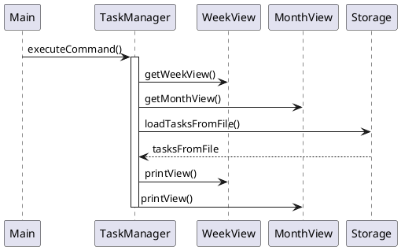

# Developer Guide

## Acknowledgements

{list here sources of all reused/adapted ideas, code, documentation, and third-party libraries -- include links to the original source as well}


## Design & Implementation

### Architecture
The Calendar application is designed with a modular architecture, consisting of the following components:

- **UI**: The `UiRenderer` class handles the rendering of the calendar views (week and month) to the console.
- **Logic**: The `Main` class acts as the central logic component, handling user input and dispatching commands to the appropriate components.
- **Data**: The `TaskManager` class manages the tasks and their corresponding dates, providing methods for adding, updating, and deleting tasks.
- **Storage**: The `Storage` class handles the persistence of tasks by reading from and writing to a file.
- **Time**: The `View` class and its subclasses (`WeekView` and `MonthView`) manage the rendering and navigation of the week and month views.

The following sequence diagram illustrates the high-level interaction between the components when executing a command:



### View Switching

The Calendar application supports switching between the week and month views, allowing users to visualize their tasks in different time perspectives. The switching functionality is implemented through the `WeekView` and `MonthView` classes, which extend the `View` abstract class.

#### View Hierarchy

The `View` abstract class provides a common interface for rendering and navigating different calendar views. It defines the following abstract methods:

- `printView(TaskManager taskManager)`: This method is responsible for rendering the view to the console based on the provided `TaskManager` instance.
- `next()`: This method advances the view to the next period (e.g., next week or next month).
- `previous()`: This method moves the view to the previous period (e.g., previous week or previous month).

The `View` class also has a protected `startOfView` field, which represents the starting date of the current view period, and a `dateFormatter` field for formatting dates.

#### WeekView

The `WeekView` class extends the `View` abstract class and provides an implementation for rendering and navigating the week view. It overrides the following methods from the `View` class:

- `printView(TaskManager taskManager)`: This method first calculates the end of the week based on the `startOfView` date. It then prints the week header using the `UiRenderer.printWeekHeader` method and the week body using the `UiRenderer.printWeekBody` method.
- `next()`: This method advances the `startOfView` date to the start of the next week by adding one week.
- `previous()`: This method moves the `startOfView` date to the start of the previous week by subtracting one week.

The `WeekView` class also provides the following utility methods:

- `getStartOfWeek()`: Returns the `startOfView` date, which represents the start of the current week.
- `getDateForDay(int dayOfWeek)`: Returns the date for a specific day of the week based on the `startOfView` date. The `dayOfWeek` parameter is expected to be a value between 1 (Monday) and 7 (Sunday).

#### MonthView

The `MonthView` class extends the `View` abstract class and provides an implementation for rendering and navigating the month view. It overrides the following methods from the `View` class:

- `printView(TaskManager taskManager)`: This method first calculates the start of the month and the first day of the month that falls on a Sunday. It then prints the month header using the `UiRenderer.printWeekHeader` method with the `isMonthView` flag set to `true`. The method iterates over the weeks in the month and calls the `printWeek` method for each week.
- `next()`: This method advances the `startOfView` date to the start of the next month.
- `previous()`: This method moves the `startOfView` date to the start of the previous month.

The `MonthView` class also provides the following private methods:

- `printWeek(LocalDate current, TaskManager taskManager)`: This method prints a single week within the month view. It iterates over the days of the week and calls the `printDay` method for each day. It also prints the tasks for the week using the `printTasksForWeek` method.
- `printDay(LocalDate current)`: This method prints the day number for a given date within the month view.
- `getMaxTasksForWeek(LocalDate weekStart, TaskManager taskManager)`: This method calculates the maximum number of tasks for a given week by iterating over the days of the week and finding the maximum number of tasks for any day.
- `printTasksForWeek(LocalDate weekStart, int maxTasks, TaskManager taskManager)`: This method prints the tasks for a given week within the month view. It iterates over the tasks and calls the `printTaskForDay` method for each task.
- `printTaskForDay(List<Task> dayTasks, int taskIndex)`: This method prints a single task for a given day within the month view.

#### View Switching in Main

The `Main` class is responsible for handling user input and dispatching commands to the appropriate components. It manages the switching between the week and month views based on the user's input.

When the user enters the `month` command, the `Main` class toggles the `inMonthView` flag and calls the `printView` method of the `MonthView` instance, rendering the month view. Similarly, when the user enters the `week` command, the `Main` class sets the `inMonthView` flag to `false` and calls the `printView` method of the `WeekView` instance, rendering the week view.

The following code snippet illustrates the view switching logic in the `Main` class:

```
while (true) {
    // ... (User input handling)

    switch (command) {
        case "month":
            monthView.printView(taskManager);
            inMonthView = !inMonthView; // Toggle month view mode
            printWeek = false;
            break;
        case "week":
            inMonthView = false;
            break;
        // ... (Other command handling)
    }

    if (printWeek) {
        if (!inMonthView) {
            weekView.printView(taskManager);
        } else {
            monthView.printView(taskManager);
        }
    }
}


This implementation allows users to switch between the week and month views seamlessly, providing a flexible and intuitive way to manage and visualize their tasks.
```

### Storage
The `Storage` class handles the persistence of tasks by reading from and writing to a file located at `./save/tasks.txt`. The `createNewFile` method creates the directory and file if they don't exist.

The `saveTasksToFile` method writes the tasks in a HashMap to the file in the following format:

```
<date>|<taskType>|<taskDescription>|<additionalData>
```

For example:

```
2023-06-01|TODO|Buy groceries
2023-06-02|EVENT|Meeting|2023-06-02|2023-06-03|09:00|11:00
2023-06-05|DEADLINE|Submit report|2023-06-10|23:59
```

The `loadTasksFromFile` method reads the tasks from the file and populates the `TaskManager` with the loaded tasks.

### Logging
The `FileLogger` class sets up a logger that writes log messages to the `logs.log` file in the project directory. The logger is configured to use the `SimpleFormatter` and to write to the file instead of the console.

### Utilities
The `DateUtils` class provides a utility method `getStartOfWeek` that returns the start date of the week for a given date.

### Task Types
The `TaskType` enum defines the different types of tasks supported by the application: `TODO`, `EVENT`, and `DEADLINE`.

### Updating the Tasks
The `update` command allows the user to update the description of an existing task. The `TaskManager` class handles the update logic through the `updateManager` method, which takes the day, task index, and new description as input.

### Adding Tasks
The `add` command allows the user to add a new task. The `TaskManager` class handles the addition of tasks through the `addManager` method, which takes the day, task type, and task description as input. Depending on the task type, additional data such as start and end dates or deadlines may be required.

### Deleting Tasks
The `delete` command allows the user to delete an existing task. The `deleteManager` method in the `TaskManager` class handles the deletion of tasks, taking the day and task index as input.

### View Switching
The application supports switching between the week and month views. The `WeekView` and `MonthView` classes extend the `View` abstract class and provide methods for rendering and navigating the respective views.

### User Interface
The `UiRenderer` class contains methods for rendering the calendar views (week and month) to the console. It provides methods for printing the header, body, and individual tasks. The `printHelp` method displays the available commands and their descriptions to the user.

### Error Handling
The application handles various exceptions, such as `TaskManagerException`, `DateTimeParseException`, and `NumberFormatException`. When an exception occurs, an error message is printed to the console, and the application continues to run.


Please note that this is a high-level overview of the design and implementation based on the provided code. You may need to adjust or expand on certain sections based on your specific requirements and additional implementation details.

## Product scope
### Target user profile

{Describe the target user profile}

### Value proposition

{Describe the value proposition: what problem does it solve?}

## User Stories

|Version| As a ... | I want to ... | So that I can ...|
|--------|----------|---------------|------------------|
|v1.0|new user|see usage instructions|refer to them when I forget how to use the application|
|v2.0|user|find a to-do item by name|locate a to-do without having to go through the entire list|

## Non-Functional Requirements

{Give non-functional requirements}

## Glossary

* *glossary item* - Definition

## Instructions for manual testing

{Give instructions on how to do a manual product testing e.g., how to load sample data to be used for testing}
