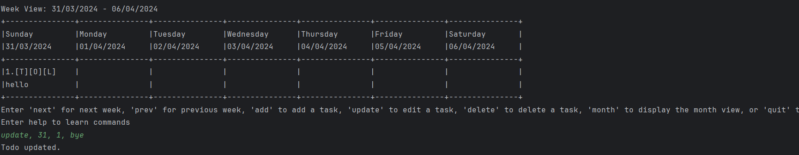
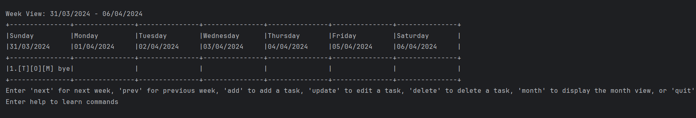
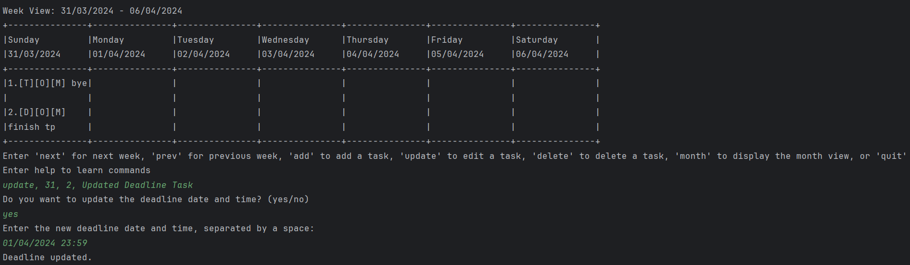
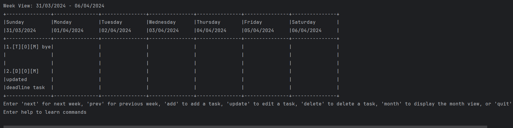
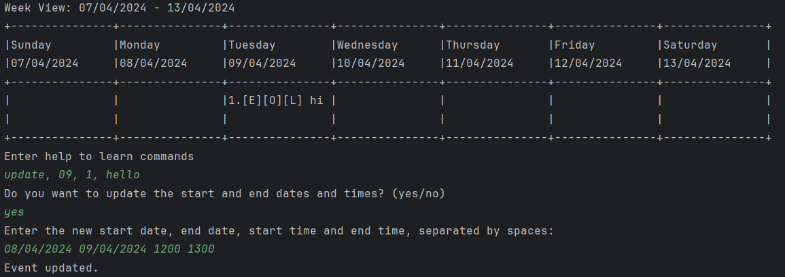
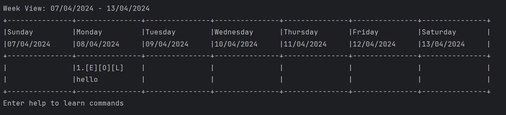
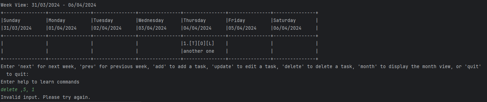

# CLI-nton Task Management User Guide

## Introduction

Welcome to CLI-nton, a powerful task management application designed to help you stay organized and productive. With a simple command-line interface, CLI-nton makes it easy to manage your tasks, whether they're todos, deadlines, or events.

This user guide provides comprehensive instructions on how to use CLI-nton, from getting started to using advanced features. Whether you're a new user or an experienced one, this guide is designed to help you get the most out of CLI-nton.

Read on to learn how to manage your tasks efficiently with CLI-nton!

## Quick Start

To quickly get started with CLI-nton, follow these simple steps:

1. Ensure that you have Java 11 or above installed on your system.
2. Download the latest version of `CLI-nton` from [here](http://link.to/clinton).
3. Open a command terminal and navigate to the directory where you downloaded CLI-nton.
4. Run the application using the command `java -jar clinton.jar`.
5. You're all set to start managing your tasks efficiently!

## Features

CLI-nton offers a variety of features to streamline your task management process:


Here are the sections for the User Guide covering the `next`, `prev`, `month`, `week`, and `quit` commands:

### Moving to Next Week or Month: `next`

The `next` command allows you to move to the next week or next month, depending on whether you are currently in the week or month view.

**Usage:**

```
next
```

**Examples:**

If you are currently in the **Week view:**
```
Week View: 31/03/2024 - 06/04/2024
+---------------+---------------+---------------+---------------+---------------+---------------+---------------+
|Sunday         |Monday         |Tuesday        |Wednesday      |Thursday       |Friday         |Saturday       |
|31/03/2024     |01/04/2024     |02/04/2024     |03/04/2024     |04/04/2024     |05/04/2024     |06/04/2024     |
+---------------+---------------+---------------+---------------+---------------+---------------+---------------+
+---------------+---------------+---------------+---------------+---------------+---------------+---------------+
```
The application will move to the following week view, displaying the following week.

```dtd
Week View: 07/04/2024 - 13/04/2024
+---------------+---------------+---------------+---------------+---------------+---------------+---------------+
|Sunday         |Monday         |Tuesday        |Wednesday      |Thursday       |Friday         |Saturday       |
|07/04/2024     |08/04/2024     |09/04/2024     |10/04/2024     |11/04/2024     |12/04/2024     |13/04/2024     |
+---------------+---------------+---------------+---------------+---------------+---------------+---------------+
+---------------+---------------+---------------+---------------+---------------+---------------+---------------+
```

If you are currently in the **Month view:**
```dtd
Month View: APRIL 2024
+---------------+---------------+---------------+---------------+---------------+---------------+---------------+
|Sunday         |Monday         |Tuesday        |Wednesday      |Thursday       |Friday         |Saturday       |
+---------------+---------------+---------------+---------------+---------------+---------------+---------------+
|               |1              |2              |3              |4              |5              |6              |
+---------------+---------------+---------------+---------------+---------------+---------------+---------------+
|7              |8              |9              |10             |11             |12             |13             |
+---------------+---------------+---------------+---------------+---------------+---------------+---------------+
|14             |15             |16             |17             |18             |19             |20             |
+---------------+---------------+---------------+---------------+---------------+---------------+---------------+
|21             |22             |23             |24             |25             |26             |27             |
+---------------+---------------+---------------+---------------+---------------+---------------+---------------+
|28             |29             |30             |               |               |               |               |
+---------------+---------------+---------------+---------------+---------------+---------------+---------------+
```
The application will move to the next month view, displaying the following month.

```dtd
Month View: MAY 2024
+---------------+---------------+---------------+---------------+---------------+---------------+---------------+
|Sunday         |Monday         |Tuesday        |Wednesday      |Thursday       |Friday         |Saturday       |
+---------------+---------------+---------------+---------------+---------------+---------------+---------------+
|               |               |               |1              |2              |3              |4              |
+---------------+---------------+---------------+---------------+---------------+---------------+---------------+
|5              |6              |7              |8              |9              |10             |11             |
+---------------+---------------+---------------+---------------+---------------+---------------+---------------+
|12             |13             |14             |15             |16             |17             |18             |
+---------------+---------------+---------------+---------------+---------------+---------------+---------------+
|19             |20             |21             |22             |23             |24             |25             |
+---------------+---------------+---------------+---------------+---------------+---------------+---------------+
|26             |27             |28             |29             |30             |31             |               |
+---------------+---------------+---------------+---------------+---------------+---------------+---------------+
```

### Moving to Previous Week or Month: `prev`

The `prev` command allows you to move to the previous week or previous month, depending on whether you are currently in the week or month view.

**Usage:**

```
prev
```

**Example:**

If you are currently in the **Week view:**
```
Week View: 21/04/2024 - 27/04/2024
+---------------+---------------+---------------+---------------+---------------+---------------+---------------+
|Sunday         |Monday         |Tuesday        |Wednesday      |Thursday       |Friday         |Saturday       |
|21/04/2024     |22/04/2024     |23/04/2024     |24/04/2024     |25/04/2024     |26/04/2024     |27/04/2024     |
+---------------+---------------+---------------+---------------+---------------+---------------+---------------+
+---------------+---------------+---------------+---------------+---------------+---------------+---------------+
```
The application will move to the previous week view, displaying the week prior.

```
Week View: 14/04/2024 - 20/04/2024
+---------------+---------------+---------------+---------------+---------------+---------------+---------------+
|Sunday         |Monday         |Tuesday        |Wednesday      |Thursday       |Friday         |Saturday       |
|14/04/2024     |15/04/2024     |16/04/2024     |17/04/2024     |18/04/2024     |19/04/2024     |20/04/2024     |
+---------------+---------------+---------------+---------------+---------------+---------------+---------------+
+---------------+---------------+---------------+---------------+---------------+---------------+---------------+
```

If you are currently in the **Month view:**
```dtd
Month View: APRIL 2024
+---------------+---------------+---------------+---------------+---------------+---------------+---------------+
|Sunday         |Monday         |Tuesday        |Wednesday      |Thursday       |Friday         |Saturday       |
+---------------+---------------+---------------+---------------+---------------+---------------+---------------+
|               |1              |2              |3              |4              |5              |6              |
+---------------+---------------+---------------+---------------+---------------+---------------+---------------+
|7              |8              |9              |10             |11             |12             |13             |
+---------------+---------------+---------------+---------------+---------------+---------------+---------------+
|14             |15             |16             |17             |18             |19             |20             |
+---------------+---------------+---------------+---------------+---------------+---------------+---------------+
|21             |22             |23             |24             |25             |26             |27             |
+---------------+---------------+---------------+---------------+---------------+---------------+---------------+
|28             |29             |30             |               |               |               |               |
+---------------+---------------+---------------+---------------+---------------+---------------+---------------+
```
The application will move to the previous month view, displaying the month prior.

```dtd

Month View: MARCH 2024
+---------------+---------------+---------------+---------------+---------------+---------------+---------------+
|Sunday         |Monday         |Tuesday        |Wednesday      |Thursday       |Friday         |Saturday       |
+---------------+---------------+---------------+---------------+---------------+---------------+---------------+
|               |               |               |               |               |1              |2              |
+---------------+---------------+---------------+---------------+---------------+---------------+---------------+
|3              |4              |5              |6              |7              |8              |9              |
+---------------+---------------+---------------+---------------+---------------+---------------+---------------+
|10             |11             |12             |13             |14             |15             |16             |
+---------------+---------------+---------------+---------------+---------------+---------------+---------------+
|17             |18             |19             |20             |21             |22             |23             |
+---------------+---------------+---------------+---------------+---------------+---------------+---------------+
|24             |25             |26             |27             |28             |29             |30             |
+---------------+---------------+---------------+---------------+---------------+---------------+---------------+
|               |               |               |meeting        |               |               |               |
+---------------+---------------+---------------+---------------+---------------+---------------+---------------+
|31             |               |               |               |               |               |               |
+---------------+---------------+---------------+---------------+---------------+---------------+---------------+
```

### Switching to Month View: `month`

The `month` command allows you to switch to the month view from any other view.

**Usage:**

```
month
```

**Example:**

If you are currently in the week view:
```
Week View: 14/04/2024 - 20/04/2024
+---------------+---------------+---------------+---------------+---------------+---------------+---------------+
|Sunday         |Monday         |Tuesday        |Wednesday      |Thursday       |Friday         |Saturday       |
|14/04/2024     |15/04/2024     |16/04/2024     |17/04/2024     |18/04/2024     |19/04/2024     |20/04/2024     |
+---------------+---------------+---------------+---------------+---------------+---------------+---------------+
+---------------+---------------+---------------+---------------+---------------+---------------+---------------+

month
```
The application will switch to the month view from week view and current month will be displayed.

```dtd
Month View: APRIL 2024
+---------------+---------------+---------------+---------------+---------------+---------------+---------------+
|Sunday         |Monday         |Tuesday        |Wednesday      |Thursday       |Friday         |Saturday       |
+---------------+---------------+---------------+---------------+---------------+---------------+---------------+
|               |1              |2              |3              |4              |5              |6              |
+---------------+---------------+---------------+---------------+---------------+---------------+---------------+
|7              |8              |9              |10             |11             |12             |13             |
+---------------+---------------+---------------+---------------+---------------+---------------+---------------+
|14             |15             |16             |17             |18             |19             |20             |
+---------------+---------------+---------------+---------------+---------------+---------------+---------------+
|21             |22             |23             |24             |25             |26             |27             |
+---------------+---------------+---------------+---------------+---------------+---------------+---------------+
|28             |29             |30             |               |               |               |               |
+---------------+---------------+---------------+---------------+---------------+---------------+---------------+
```

### Switching to Week View: `week`

The `week` command allows you to switch to the week view from any other view.

**Usage:**

```
week
```

**Example:**

If you are currently in the **Month view:**

```dtd
Month View: APRIL 2024
+---------------+---------------+---------------+---------------+---------------+---------------+---------------+
|Sunday         |Monday         |Tuesday        |Wednesday      |Thursday       |Friday         |Saturday       |
+---------------+---------------+---------------+---------------+---------------+---------------+---------------+
|               |1              |2              |3              |4              |5              |6              |
+---------------+---------------+---------------+---------------+---------------+---------------+---------------+
|7              |8              |9              |10             |11             |12             |13             |
+---------------+---------------+---------------+---------------+---------------+---------------+---------------+
|14             |15             |16             |17             |18             |19             |20             |
+---------------+---------------+---------------+---------------+---------------+---------------+---------------+
|21             |22             |23             |24             |25             |26             |27             |
+---------------+---------------+---------------+---------------+---------------+---------------+---------------+
|28             |29             |30             |               |               |               |               |
+---------------+---------------+---------------+---------------+---------------+---------------+---------------+
```

The application will switch to the **Week view.**

```
Week View: 21/04/2024 - 27/04/2024
+---------------+---------------+---------------+---------------+---------------+---------------+---------------+
|Sunday         |Monday         |Tuesday        |Wednesday      |Thursday       |Friday         |Saturday       |
|21/04/2024     |22/04/2024     |23/04/2024     |24/04/2024     |25/04/2024     |26/04/2024     |27/04/2024     |
+---------------+---------------+---------------+---------------+---------------+---------------+---------------+
+---------------+---------------+---------------+---------------+---------------+---------------+---------------+
```

### Adding a New Task: `add`
> Note that there are 3 different types of tasks: Todos, Events and Deadlines.
> This section details how to add all 3 types of tasks to your calendar.

Adds a new task to the calendar.

Format: `add, <day>, <taskType>, <taskDescription>`

You will be prompted on further inputs based on your desired task type.

#### Adding a `Todo`
> Todos are regular tasks with no time limit!

How to add a `Todo`: `add, 4, T, Sample Todo Task`

Your Todo Task is now added to your calendar on the 4th (of whichever week/month you are viewing)!

Here's what that would look like:


#### Adding a `Deadline`
> Deadlines are tasks with an additional date/time of completion!

How to add a `Deadline`: `add, 3, D, Sample Deadline Task`

You will then be asked to provide the deadline (date and time) for this task.

`Enter the deadline date and time of this task, separated by a space: `

Example format: `06/04/2024 1800`

Your Deadline Task is now added to your calendar on the 3rd (of whichever week/month you are viewing)!

Here's what that would look like:


#### Adding an `Event`
> Events are tasks with a start and end date/time!

How to add an `Event`: `add, 5, E, Sample Event Task`

You will then be asked to provide the start and end dates/times for this task.

`Enter the start date of this task, along with the start time separated by a space: `

Example format: `05/04/2024 1200`

`Enter the end date of this task, along with the end time separated by a space: `

Example format: `07/05/2024 2000`

Your Event Task is now added to your calendar on the 5th (of whichever week/month you are viewing)!

Here's what that would look like:


#### **Notes to users**
> Commas `,` and pipes `|` are used in our application as command delimiters as well as for file storage purposes.
> Please avoid using these in your task descriptions as it could lead to parsing errors or storage issues.
>
> You have been **informed**!

### Updating a Task Description: `update`

You can update the description of a task using the `update` command. This command allows you to change the description 
of a task on a specific day for todos, or additionally also change the date and time for deadlines and events.

Format: `update, <day>, <taskIndex>, <newDescription>`

You will be prompted on further inputs based on the task type you seek to update.

#### Updating a `Todo`:

```
update, 31, 1, bye
```

Your Todo will now be updated to `bye` on the 31st (of whichever week/month you are viewing)!
Here's a sample of what that would look like:



After updating the todo, the task will be displayed as follows:



### Updating a Task Description: `update`

>You can update the description of a task using the `update` command. This command allows you to change the description of a task on a specific day for todos, or additionally also change the date and time for deadlines and events.

Format: `update, <day>, <taskIndex>, <newDescription>`

You will be prompted on further inputs based on the task type you seek to update.

#### Updating a `Todo`:

```
update, 31, 1, bye
```

Your Todo will now be updated to `bye` on the 31st (of whichever week/month you are viewing)!
Here's a sample of what that would look like:


After updating the todo, the task will be displayed as follows:


#### Updating a `Deadline`:

To update a Deadline, follow this format:
```
update, 31, 2, Updated Deadline Task
```

Your Deadline Task will be updated to `Updated Deadline Task` on the 31st! You will then be prompted to provide the 
updated deadline date and time, if desired.

Here's a visual representation of the update process:



After the update, the task will be displayed as follows:



#### Updating an `Event`:

To update an Event, use the following format:
```
update, 1, 3, Updated Event Task
```

Your Event Task will be updated to `Updated Event Task` on the 1st! You will then be prompted to provide the updated 
start and end dates/times for the event.

Here's an example illustrating the update process:



After the update, the task will be displayed as follows:



By following these instructions, you can efficiently update task descriptions in your calendar, ensuring accurate and 
up-to-date scheduling.


### Deleting a Task: `delete`

Deletes a task.

Format: `delete, <day>, <taskIndex>`
- Deletes the task at the specified index on the given day
- Shows an error message if the task index does not exist

Example of usage:
- Deletes task 2 on Wednesday

```
//deletes task 2 on day 3
delete,3,2

//deletes task 1 on day 5
delete,5,1
```
- Shows error message if task does not exist

```
//attempts to delete task 1 on day 5, but the task does not exist
delete,5,1
```
Output: 


### Marking a Task as Complete or Incomplete: `mark`

Marks a task as complete or not complete.

Format: `mark, <day>, <taskIndex>`
- Marks task as complete if it is incomplete
- Marks task as incomplete if it is complete

Example of usage:

```
// marks task 3 on day 2 as complete
mark,2,3

// marks task 1 on day 4 as incomplete
mark,4,1
```

### Setting Priority Level for a Task: `priority`

Sets priority level for a task.

Format: `priority, <day>, <taskIndex>, <priority>`
- Priority levels: `H` (high), `M` (medium), `L` (low)
- Default priority level: `L`
- Setting priority level will update any existing priority level for the task to the new level

Example of usage:

```
// sets priority level HIGH for task 1 on day 5
priority,5,1,H

// sets priority level MEDIUM for task 2 on day 3
priority,3,2,M
```

### Quitting the Application: `quit`

The `quit` command allows you to exit the CLI-nton application.

**Usage:**

```
quit
```

**Example:**

```
Week View: 21/04/2024 - 27/04/2024
+---------------+---------------+---------------+---------------+---------------+---------------+---------------+
|Sunday         |Monday         |Tuesday        |Wednesday      |Thursday       |Friday         |Saturday       |
|21/04/2024     |22/04/2024     |23/04/2024     |24/04/2024     |25/04/2024     |26/04/2024     |27/04/2024     |
+---------------+---------------+---------------+---------------+---------------+---------------+---------------+
+---------------+---------------+---------------+---------------+---------------+---------------+---------------+

quit
Exiting Calendar...
```
The application will exit after displaying a goodbye message.

### ICS Exporting and Importing: `ics` `[coming in v2.1]`
Exporting and importing tasks to and from an ICS file.

Format: `ics <export> <filename>` or `ics <import> <filename>`
- Exporting tasks to an ICS file will create a new ICS file with the specified filename
- Importing tasks from an ICS file will add the tasks from the ICS file to the current task list

Example of usage:

```
// exports tasks to an ICS file named "tasks.ics" into the current working directory
ics,export,tasks.ics

// imports tasks from an ICS file named "tasks.ics" in the current working directory
ics,import,tasks.ics
```

## FAQ

**Q**: How do I transfer my data to another computer?

**A**: You can transfer your data to another computer by copying the data file saved in the CLI-nton application directory. The data file is typically named `clintonData.txt` and contains all your tasks. Simply copy this file to the same location on the other computer to transfer your tasks.

## Command Summary

For a quick reference, here's a summary of available commands:

- Add todo `todo n/TODO_NAME d/DEADLINE`
- Move to next week or month `next`
- Move to previous week or month `prev`
- Update task description `update <day> <taskIndex> <newDescription>`
- Add new task `add <day> <taskType> <taskDescription>`
- Delete task `delete <day> <taskIndex>`
- Mark task as complete or not complete `mark <day> <taskIndex>`
- Set priority level for task `priority <day> <taskIndex> <priority>`
- Switch to month view `month`
- Switch to week view `week`
- Quit the application `quit`

Start managing your tasks efficiently with CLI-nton!
