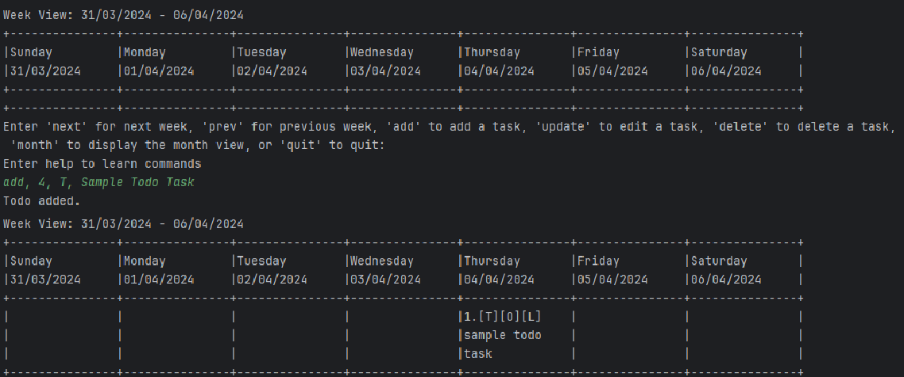
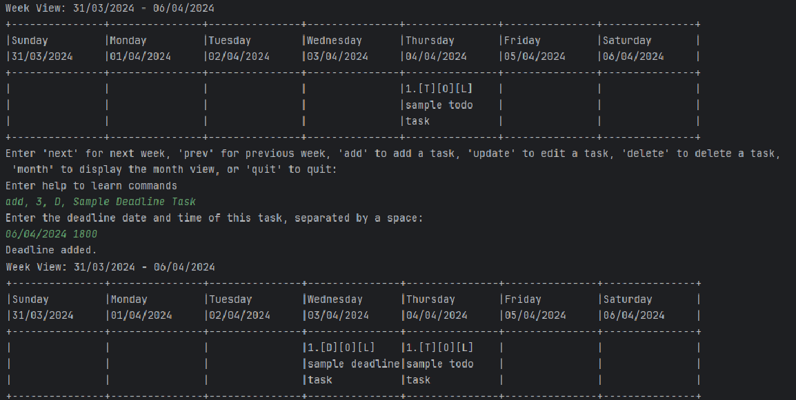
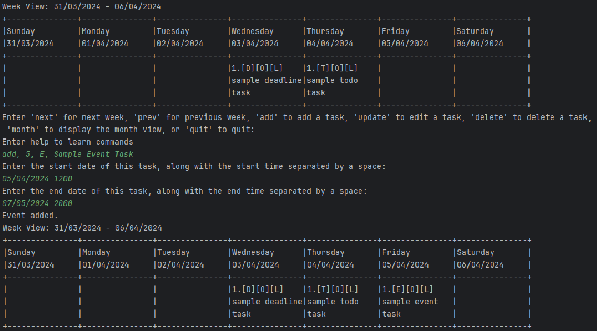

# CLI-nton Task Management User Guide

## Introduction

Welcome to CLI-nton, a task management application designed to help you stay organized and productive.

## Quick Start

To quickly get started with CLI-nton, follow these simple steps:

1. Ensure that you have Java 11 or above installed on your system.
2. Download the latest version of `CLI-nton` from [here](http://link.to/clinton).
3. Open a command terminal and navigate to the directory where you downloaded CLI-nton.
4. Run the application using the command `java -jar clinton.jar`.
5. You're all set to start managing your tasks efficiently!

## Features

CLI-nton offers a variety of features to streamline your task management process:


### Moving to Next Week or Month: `next`

Moves to the next week or month view.

Example of usage:

```
next
```

### Moving to Previous Week or Month: `prev`

Moves to the previous week or month view.

Example of usage:

```
prev
```

### Updating a Task Description: `update`

Updates a task description.

Format: `update <day> <taskIndex> <newDescription>`

Example of usage:

```
update Monday 1 Review User Guide and make edits
```

### Adding a New Task: `add`
> Note that there are 3 different types of tasks: Todos, Events and Deadlines.
> This section details how to add all 3 types of tasks to your calendar. 

Adds a new task to the calendar. 

Format: `add, <day>, <taskType>, <taskDescription>`

You will be prompted on further inputs based on your desired task type.

#### Adding a `Todo`
> Todos are regular tasks with no time limit!

How to add a `Todo`: `add, 4, T, Sample Todo Task`

Your Todo Task is now added to your calendar on the 4th (of whichever week/month you are viewing)!

Here's what that would look like:


#### Adding a `Deadline` 
> Deadlines are tasks with an additional date/time of completion!

How to add a `Deadline`: `add, 3, D, Sample Deadline Task`

You will then be asked to provide the deadline (date and time) for this task.

`Enter the deadline date and time of this task, separated by a space: `

Example format: `06/04/2024 1800`  

Your Deadline Task is now added to your calendar on the 3rd (of whichever week/month you are viewing)!

Here's what that would look like: 


#### Adding an `Event`
> Events are tasks with a start and end date/time!

How to add an `Event`: `add, 5, E, Sample Event Task`

You will then be asked to provide the start and end dates/times for this task.

`Enter the start date of this task, along with the start time separated by a space: `

Example format: `05/04/2024 1200`

`Enter the end date of this task, along with the end time separated by a space: `

Example format: `07/05/2024 2000`

Your Event Task is now added to your calendar on the 5th (of whichever week/month you are viewing)!

Here's what that would look like: 


#### **Notes to users**
> Commas `,` and pipes `|` are used in our application as command delimiters as well as for file storage purposes.
> Please avoid using these in your task descriptions as it could lead to parsing errors or storage issues.
> 
> You have been **informed**!

### Deleting a Task: `delete`

Deletes a task.

Format: `delete <day> <taskIndex>`

Example of usage:

```
delete Wednesday 2
```

### Marking a Task as Complete or Incomplete: `mark`

Marks a task as complete or not complete.

Format: `mark <day> <taskIndex>`

Example of usage:

```
mark Thursday 3
```

### Setting Priority Level for a Task: `priority`

Sets priority level for a task.

Format: `priority <day> <taskIndex> <priority>`

Example of usage:

```
priority Friday 1 High
```

### Switching to Month View: `month`

Switches to the month view.

Example of usage:

```
month
```

### Switching to Week View: `week`

Switches to the week view.

Example of usage:

```
week
```

### Quitting the Application: `quit`

Exits the calendar application.

Example of usage:

```
quit
```

## FAQ

**Q**: How do I transfer my data to another computer?

**A**: You can transfer your data to another computer by copying the data file saved in the CLI-nton application directory. The data file is typically named `clintonData.txt` and contains all your tasks. Simply copy this file to the same location on the other computer to transfer your tasks.

## Command Summary

For a quick reference, here's a summary of available commands:

- Add todo `todo n/TODO_NAME d/DEADLINE`
- Move to next week or month `next`
- Move to previous week or month `prev`
- Update task description `update <day> <taskIndex> <newDescription>`
- Add new task `add <day> <taskType> <taskDescription>`
- Delete task `delete <day> <taskIndex>`
- Mark task as complete or not complete `mark <day> <taskIndex>`
- Set priority level for task `priority <day> <taskIndex> <priority>`
- Switch to month view `month`
- Switch to week view `week`
- Quit the application `quit`

Start managing your tasks efficiently with CLI-nton!
